<h1 align="center">基于SpringBoot的校园体育场馆（设施）使用管理系统【带论文】</h1>

- <b>完整代码获取地址：从戎源码网 ([https://armycodes.com/](https://armycodes.com/))</b>
- <b>技术探讨、资料分享，请加QQ群：692619798</b>
- <b>作者微信：19941326836  QQ：3645296857</b>
- <b>承接计算机毕业设计、Java毕业设计、Python毕业设计、深度学习、机器学习</b>
- <b>选题+开题报告+任务书+程序定制+安装调试+论文+答辩ppt 一条龙服务</b>
- <b>所有选题地址 ([https://github.com/Descartes007/allProject](https://github.com/Descartes007/allProject)) </b>

## 一、项目介绍

基于SpringBoot的校园体育场馆（设施）使用管理系统，系统角色为后台管理员与前端用户，主要功能如下
### 后台管理员：
- 基本操作：登录、修改密码、获取/修改个人信息
- 用户管理：用户列表分页、查看用户详情、重置密码、新增/修改/删除用户、session 管理
- 场地管理：场地列表分页、查看场地详情、新增场地、修改场地、逻辑删除、上架/下架、场地图片管理、点击统计
- 预约/订单管理：订单列表分页、订单详情、后台保存/修改/删除订单、退款处理、订单状态管理（已支付/已退款/已完成）
- 公告管理：公告列表/详情、新增/修改/删除、前端/后端发布区分
- 论坛管理：帖子列表/详情、新增/修改/删除、级联用户/管理员信息处理
### 前端用户：
- 基本操作：注册、登录、退出、获取/修改个人信息、session 查询
- 场地浏览：获取场地列表、按条件筛选（名称/类型/时间段）、查看场地详情（含图片与点击量）
- 预约下单：前端下单并支付（检查并扣减用户余额）、生成订单、查看订单详情/列表、申请退款/取消预约
- 发布/互动：查看/发布论坛帖子、查看公告、富文本编辑帖子内容

## 二、项目技术

- 编程语言：Java（后端）、JavaScript/Vue（前端）
- 项目架构：B/S 架构，前后端分离（前端 Vue 打包部署到静态资源）
- 前端技术：Vue 2.x、Vue Router、Element UI、Axios、vue-quill-editor
- 后端技术：Spring Boot 2.2.2、Spring MVC、MyBatis / MyBatis-Plus（ORM）、MySQL

## 三、运行环境

- JDK版本：1.8及以上都可以
- 操作系统：Windows7/10、MacOS
- 开发工具：IDEA、Ecplise、MyEclipse都可以

## 四、数据库配置文件

- npm版本：6.14.13及以上都可以
- Redis版本：3.2.100及以上都可以
- 文件名：application.yml
- 编码类型：utf8

## 论文截图

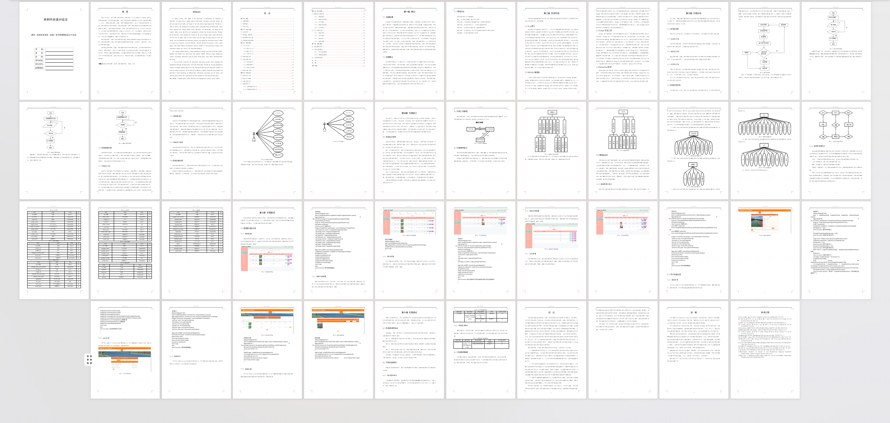

## 系统截图

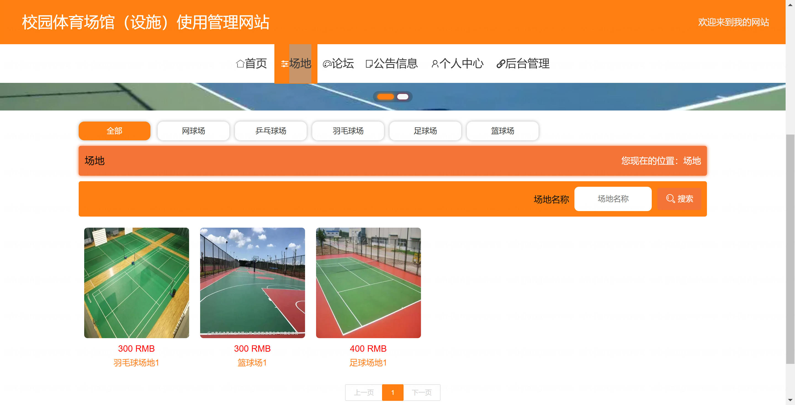

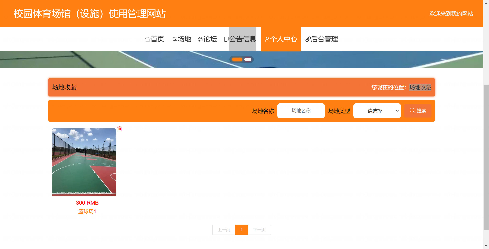

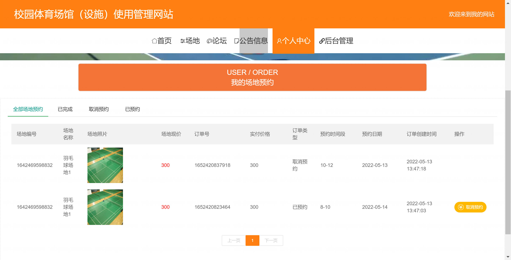

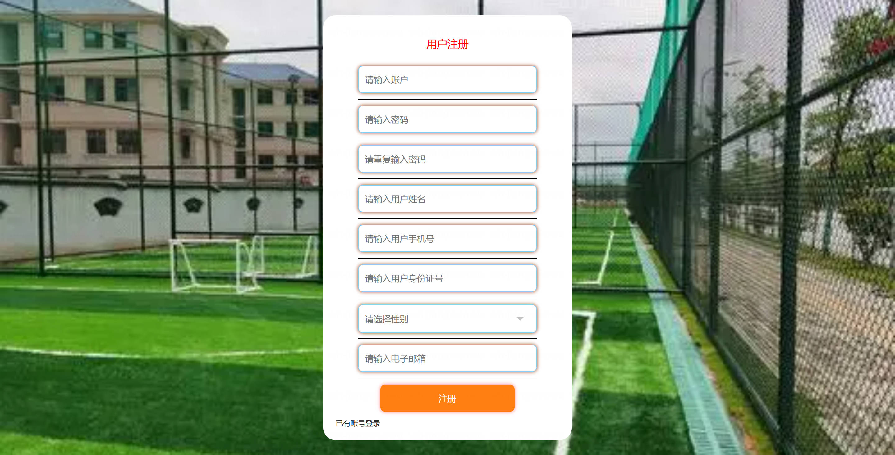

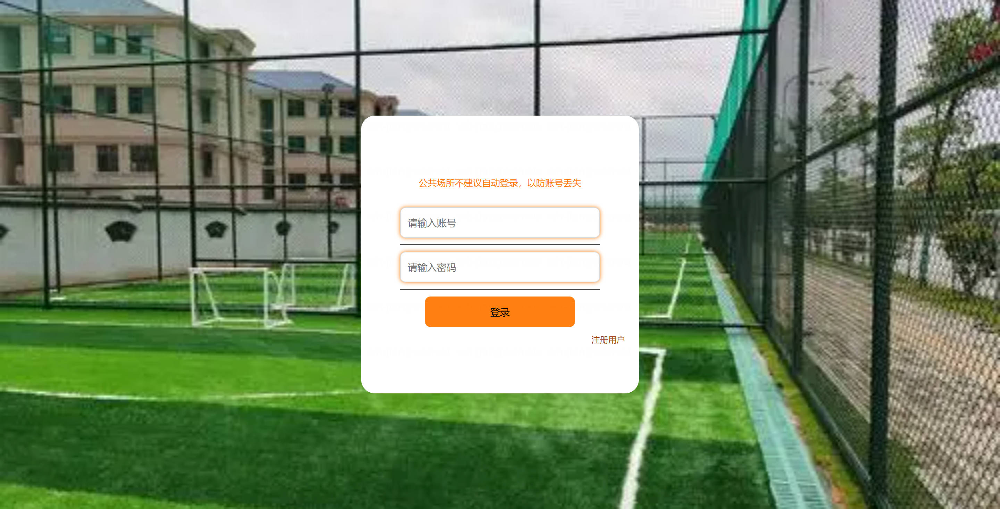

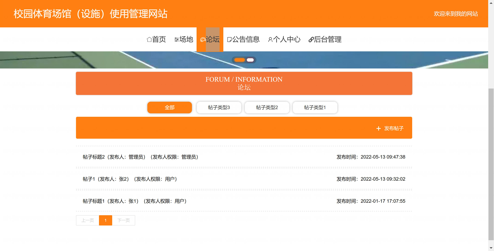

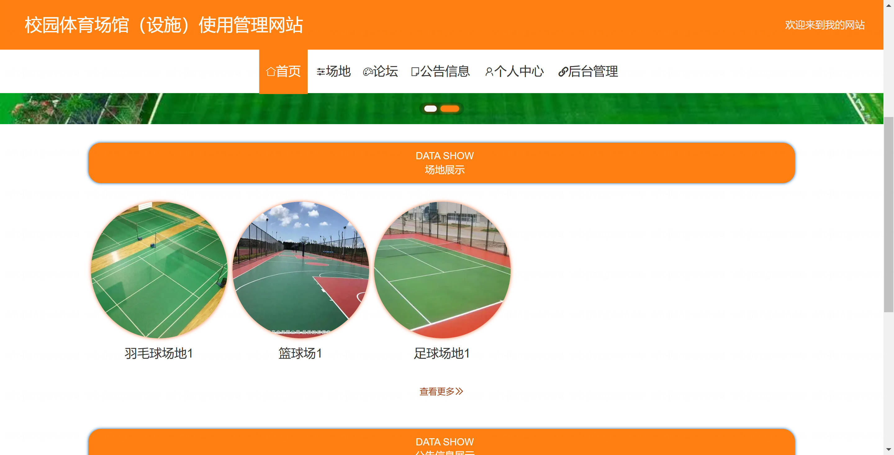

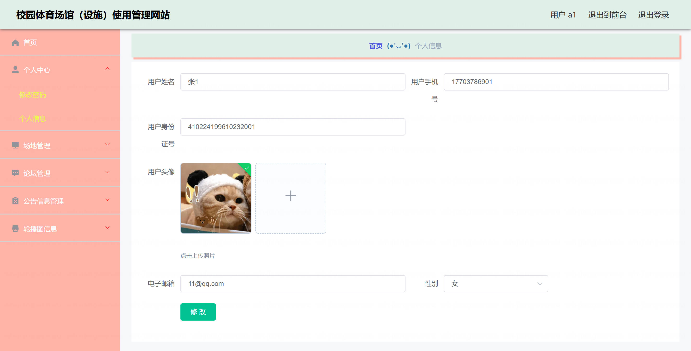

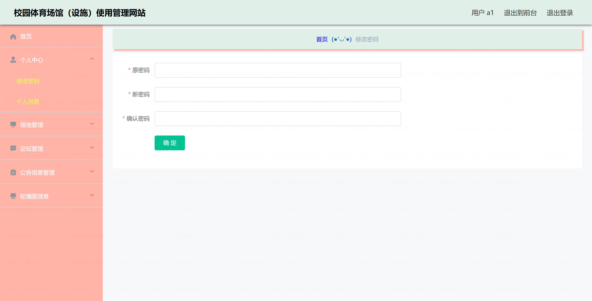

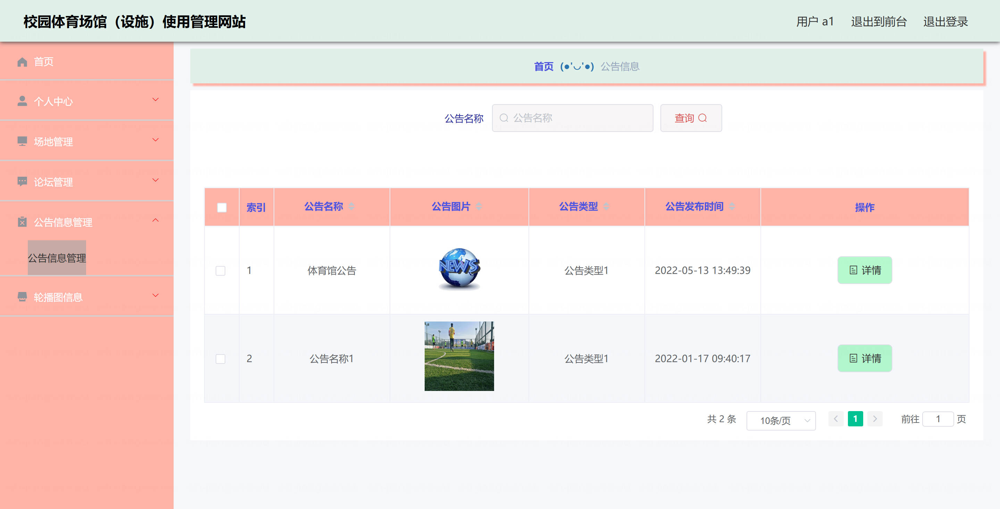
